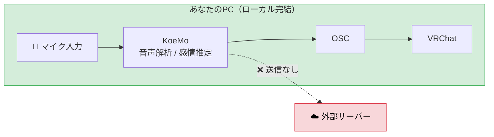

# よくある質問

## GPUがないPCでも使えますか？

CPUのみでも動作します。NVIDIA GPUがあると、より高速・快適に動作します。

## 音声データはどこかに送信されますか？

いいえ。すべてローカル処理です。音声データの外部送信や録音保存は一切行いません。

## セットアップが難しそうで不安です

初回起動時のセットアップウィザードが自動で準備を行います。コマンド操作やPythonの知識は不要です。

## 自分の声にうまく反応してくれません

キャリブレーション機能を使うと、自分の声の特徴に合わせて精度を調整できます。詳しくは[導入ガイド](getting-started.md)を参照してください。

## どんなVRChatアバターでも使えますか？

アバター側にOSCを受け取るギミックの設定が必要です。詳しくは[VRChatアバター側の設定](vrchat-setup.md)を参照してください。

## 他のアバターギミックと一緒に使えますか？

主要なギミックとの併用確認を進めています。確認済みリストは追って公開予定です。
